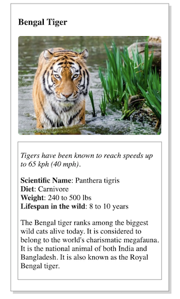

# AnimalCard
Project 1 for the Udacity Intro To Programming Nanodegree

The main goal was to put the achieved knowledge in HTML & CSS to work and duplicate a given Animal Trading Card with your animal of choice. 

Screenshot:

